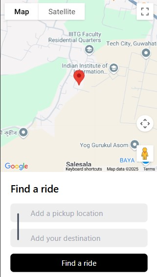
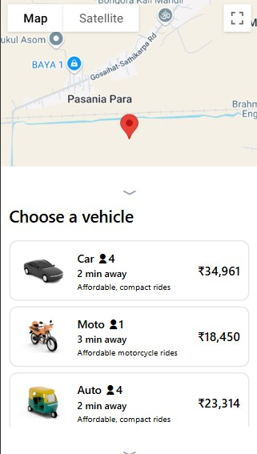
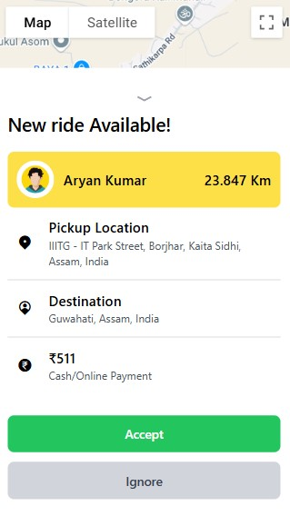
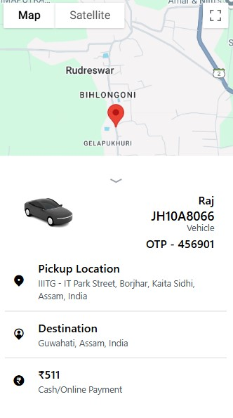
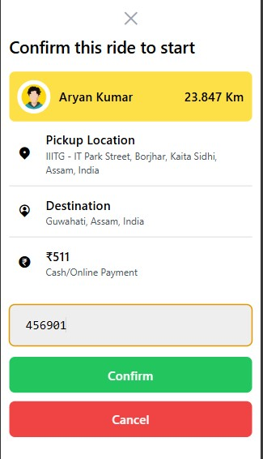
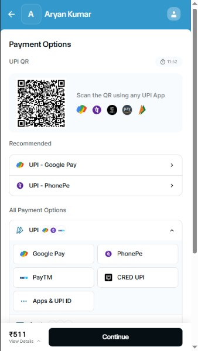
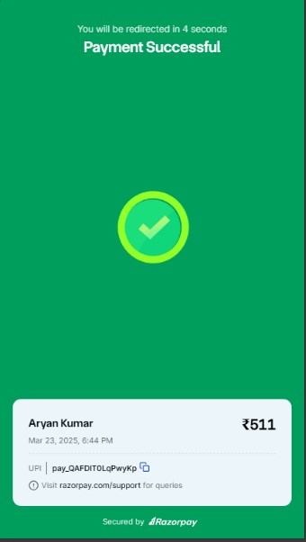

# RapiGo - A Web-Based Smart Ride-Sharing Solution

RapiGo is a full-stack ride-hailing web application inspired by platforms like Rapido. Built with the MERN stack and powered by real-time location tracking via Socket.IO and Google Maps, it offers a seamless ride-booking experience with secure payments, live ride updates, and OTP verification — all in a modern, responsive UI.

## 🚀 Features

- **User & Captain Authentication**
  - JWT-based authentication
  - Secure password hashing
  - Session management

- **Real-time Location Tracking**
  - Google Maps integration
  - Live location updates
  - Distance calculation

- **Ride Management**
  - Booking system
  - Fare calculation
  - OTP verification
  - Ride status tracking

- **Payment Integration**
  - Razorpay payment gateway
  - Secure transaction handling

## 🛠️ Tech Stack

- **Frontend**: React.js, TailwindCSS, Socket.io-client
- **Backend**: Node.js, Express.js, Socket.io
- **Database**: MongoDB
- **APIs**: Google Maps, Razorpay
- **Authentication**: JWT

## 🌟 Key Components

### Backend
- RESTful API endpoints
- Real-time WebSocket communication
- Geolocation services
- Payment processing

### Frontend
- Responsive UI with TailwindCSS
- Real-time location tracking
- Interactive map interface
- Live ride status updates

## 🚀 Getting Started

1. Clone the repository
2. Install dependencies in both frontend and backend:
   ```bash
   cd Frontend && npm install
   cd Backend && npm install
   ```
3. Set up environment variables
4. Start the servers:
   ```bash
   # Backend
   npm start
   
   # Frontend
   npm run dev
   ```

## 📱 Screenshots










